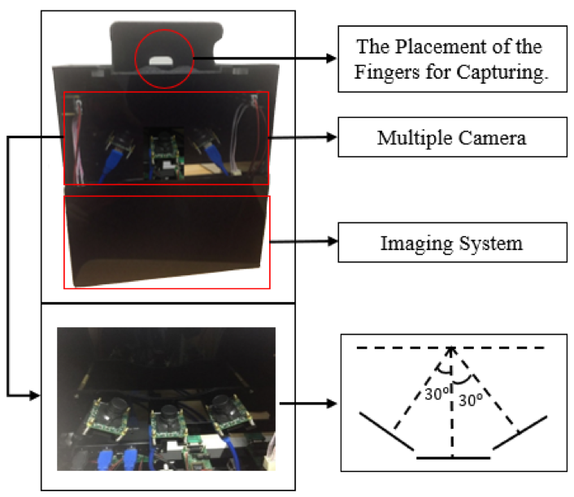
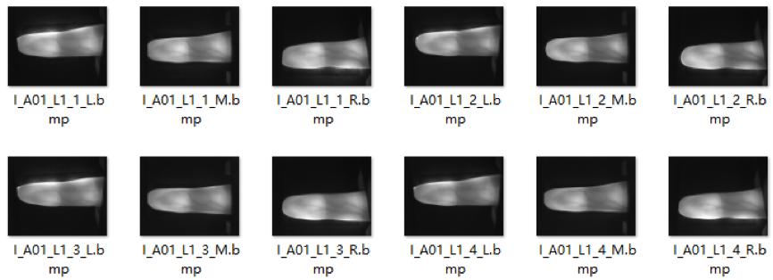
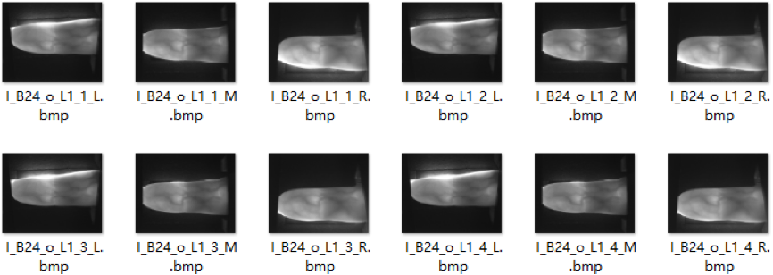

#  A challenging benchmark dataset with multiview finger vein images

The corresponding paper, titled 'Finger Vein Verification using Intrinsic and Extrinsic Features' is accepted by the 2021 International Joint Conference on Biometrics (IJCB 2021)

## Abstraction
The finger vein has attracted substantial attention due to the strong security. However, existing available-publicly datasets only consider the ideal case without offsets and rotations. To test the robustness against rotation of the fingers in vein verification, an in-house dataset with multiview finger vein images is established, denoted as MultiView-FV. One finger is captured by multiple cameras at the same time.Therefore, without alignment and rotation-specific operations, MultiView-FV provides a challenging benchmark finger vein dataset.

## Brief Description

The MultiView-FV dataset was acquired from the male and female volunteers in The Shenzhen University campus. This database has been largely acquired during Sept. 2018 to Dec. 2018 using a contactless imaging device shown as Fig 1, which can collect images from three angles(L.M.R.) at the same time The currently available database has 6480 images from the 135 subjects. The finger images were acquired in two separate sessions with a minimum interval of two months. In each session, each of the subjects provided 12 image samples from the index finger and middle finger respectively from both left-hand and right-hand. Therefore, each subject provided 48 images. All the images are in bitmap (*.bmp) format with the 1280 * 1024 pixel size

## Sample Images

Naming Rule:
A: Collected from female
B: Collected from male
o: Collection from low-quality finger

## Download and Copyright

1.	You need to download the protocol for our database. We trust that the terms of this protocol are acceptable to you and that you will be able to sign and email the attached copy of this protocol to us to confirm your agreement to its terms.

The email address is feng.liu@szu.edu.cn,

2.	Then, there are two ways to get data:
(i)	The first way is that we provide you with the Baidu cloud data links and you should download the data by yourself.
(ii)	The second way is that you provide us with your address. We send you the mobile hard disk in which the data is stored, but the necessary expenses (postage, the cost of mobile hard disk, and labor, i.e.) need to be paid by you.
You need to explain the way you choose in your email.
Thank you very much for your cooperation!

## Contributor

Feng Liu, Liying Lin, Haozhe Liu, Wentian Zhang

## Organization

Computer Vision Institute , College of Computer Science and Software Engineering, Shenzhen University

## Acknowledgment
The work is partially supported by the National Natural Science Foundation of China under grants no. 62076163 and 91959108, the Shenzhen Fundamental Research fund JCYJ20190808163401646, JCYJ20180305125822769 and Tencent “Rhinoceros Birds”-Scientific Research Foundation for Young Teachers of Shenzhen University.

## Contact us
feng.liu@szu.edu.cn, {linliying2019, liuhaozhe2019}@email.szu.edu.cn, zhangwentianml@gmail.com

All the rights of The Shenzhen University Finger Image Database are reserved and commercial use/distribution of this database is strictly prohibited.
